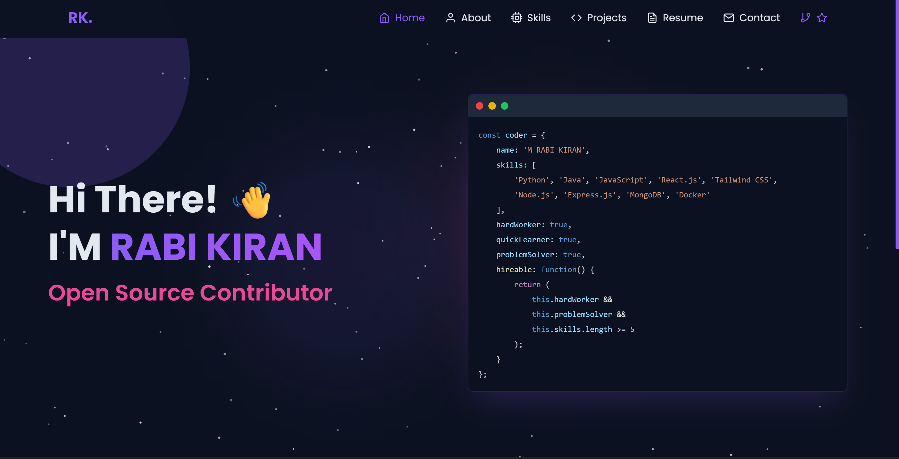

# Rabi Kiran - Personal Portfolio ✨

A modern and fully responsive portfolio built with React, Tailwind CSS, and Framer Motion to showcase my skills and projects.

**🔗 [View Live Demo](https://rabi-kiran-web.vercel.app/)**

<br>

<p align="center">
  <a href="https://rabi-kiran-web.vercel.app/">
    
  </a>
</p>

---

### 🌟 Key Features

- **Fully Responsive:** Mobile-first design that looks great on all devices.
- **Multi-Page Structure:** Clean navigation between pages using React Router.
- **Engaging UI/UX:** Smooth animations with Framer Motion and a starry background.
- **Data-Driven Content:** All personal data is managed from a central `config.js` file for easy updates.

---

### 🛠️ Tech Stack

- **Framework:** React (with Vite)
- **Styling:** Tailwind CSS
- **Animations:** Framer Motion
- **Deployment:** Vercel

---

### 🚀 Getting Started

To run this project locally, follow these steps:

1.  **Clone the repository:**
    ```sh
    git clone https://github.com/Rabikiran67/rabi-kiran-web.git
    ```
2.  **Navigate to the project directory and install dependencies:**
    ```sh
    cd rabi-kiran-web
    npm install
    ```
3.  **Start the development server:**
    ```sh
    npm run dev
    ```
    The site will be running at `http://localhost:5173`.

---

### 📞 Connect with Me

- **LinkedIn:** [@Rabi-kiran](https://www.linkedin.com/in/rabi-kiran-824881239/)
- **Instagram:** [@gipsy.exe](https://www.instagram.com/gipsy.exe/)
- **GitHub:** [@Rabikiran67](https://github.com/Rabikiran67)

---

### 📄 License

This project is available under the [MIT License](LICENSE).
