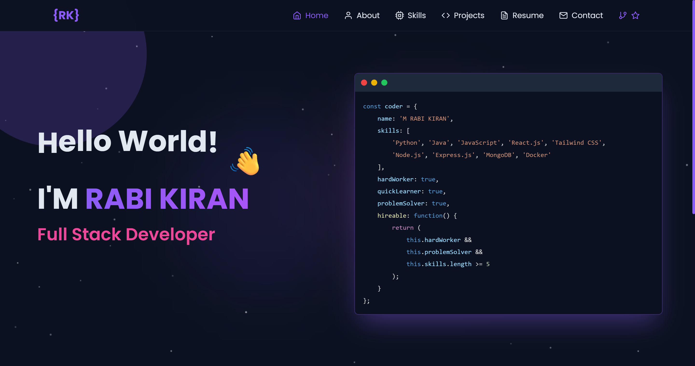

# 🚀RABI KIRAN - Portfolio

A modern, responsive portfolio website built with React, Vite, and Tailwind CSS. Features a beautiful UI with smooth animations, interactive components, and optimized performance.




## 🛠️ Tech Stack

### Frontend
- **React 18** - UI library
- **Vite** - Build tool and dev server
- **Tailwind CSS** - Utility-first CSS framework
- **Framer Motion** - Animation library
- **React Router** - Client-side routing

### Audio & Visual
- **Web Audio API** - Real-time audio analysis
- **React TSParticles** - Interactive particle effects
- **React Icons** - Icon library

### Performance & Optimization
- **React.lazy()** - Code splitting
- **useMemo/useCallback** - Performance optimization
- **Intersection Observer** - Lazy loading
- **Custom performance utilities**

## 🚀 Getting Started

### Prerequisites
- Node.js (v16 or higher)
- npm or yarn

### Installation

1. **Clone the repository**
   ```bash
   git clone https://github.com/Rabikiran67/rabi-kiran-web.git
   cd rabi-kiran-web
   ```

2. **Install dependencies**
   ```bash
   npm install
   ```

3. **Start the development server**
   ```bash
   npm run dev
   ```

4. **Open your browser**
   Navigate to `http://localhost:5173` (or the port shown in terminal)

### Build for Production

```bash
npm run build
```

The built files will be in the `dist` folder.

## 🤝 Contributing

1. Fork the repository
2. Create a feature branch (`git checkout -b feature/AmazingFeature`)
3. Commit your changes (`git commit -m 'Add some AmazingFeature'`)
4. Push to the branch (`git push origin feature/AmazingFeature`)
5. Open a Pull Request

## 📄 License

This project is licensed under the MIT License - see the [LICENSE](LICENSE) file for details.

## 📞 Contact

- **Email**: rabikiran0406@gmail.com
- **LinkedIn**: [Rabi Kiran](https://www.linkedin.com/in/rabi-kiran-824881239/)
- **GitHub**: [@Rabikiran67](https://github.com/Rabikiran67)
- **Instagram**: [@gipsy.exe](https://www.instagram.com/gipsy.exe/)

## 🙏 Acknowledgments

- [React](https://reactjs.org/) - UI library
- [Tailwind CSS](https://tailwindcss.com/) - CSS framework
- [Framer Motion](https://www.framer.com/motion/) - Animation library
- [React Icons](https://react-icons.github.io/react-icons/) - Icon library
- [Vite](https://vitejs.dev/) - Build tool

---

⭐ **Star this repository if you found it helpful!**
